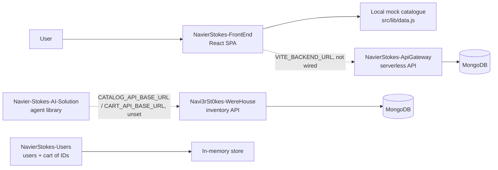
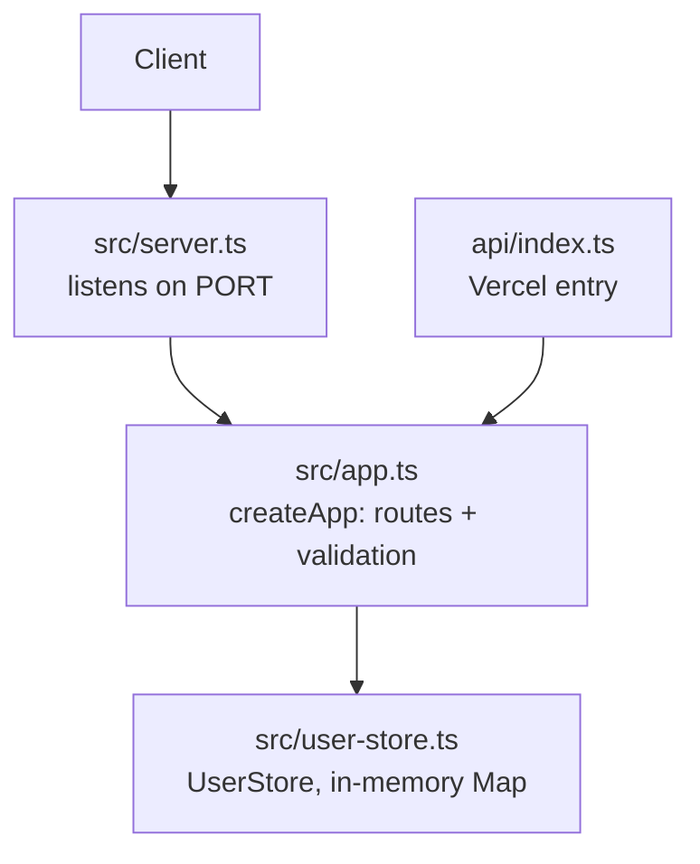

# NavierStokes — Users

TypeScript/Express API for MarkECIA users and their cart. The cart stores product IDs only; the product catalogue is
out of scope for this service.

## Overview

This repository owns **user identity and cart membership**, nothing else. A cart here is an ordered list of product
ID strings — it carries no prices, no names, no stock, and no totals. Resolving those IDs into products is the
caller's job, which keeps this service independent of any catalogue schema.

Storage is an in-process `Map`: data lives as long as the process does. There is no database, no authentication, and
no session handling.

## System context

MarkECIA is split across five independent repositories:

| Repository | Responsibility |
| --- | --- |
| [`NavierStokes-FrontEnd`](https://github.com/Navi3rSt0kes/NavierStokes-FrontEnd) | React SPA — storefront, cart, and shopping-assistant UI |
| [`NavierStokes-ApiGateway`](https://github.com/Navi3rSt0kes/NavierStokes-ApiGateway) | MongoDB-backed HTTP API (auth, products, cart, orders, rule-based agent chat) plus a separate local in-memory service sandbox |
| [`Navi3rSt0kes-WereHouse`](https://github.com/Navi3rSt0kes/Navi3rSt0kes-WereHouse) | Inventory API — catalogue CRUD, search, substitutes, cart validation, stock reservations |
| [`NavierStokes-Users`](https://github.com/Navi3rSt0kes/NavierStokes-Users) | Users API with a per-user cart that stores product IDs only *(this repository)* |
| [`Navier-Stokes-AI-Solution`](https://github.com/Navi3rSt0kes/Navier-Stokes-AI-Solution) | `shopping-agent-core` — Python agent-orchestration library (planner + deterministic executor) |

> **Integration status.** No repository calls another in code today. In the diagram below, solid arrows are calls that
> exist in source; dashed arrows are integration points that exist only as configuration.



## Features

- **User CRUD** with UUID identifiers generated by `node:crypto`.
- **Input validation**: `name` must be a non-empty string, `email` must match `^\S+@\S+\.\S+$`.
- **Normalization**: names are trimmed and emails are trimmed and lower-cased before storage.
- **Cart as a list of IDs**, allowing repeated entries — deleting removes a single occurrence, not every match.
- **Health endpoint** for readiness checks.
- **Injectable store**: `createApp(store)` accepts a `UserStore`, which is what the test suite uses.

## Architecture



`createApp()` returns a configured Express application without binding a port, so the same app object serves the
local server, the test suite, and the Vercel entry point.

## Tech Stack

| Layer | Technology |
| --- | --- |
| Language | TypeScript (ES2022, NodeNext, `strict`) |
| Framework | Express 5 |
| Storage | In-memory `Map` (`src/user-store.ts`) |
| Dev runtime | `tsx` watch mode |
| Tests | `node:test` against the compiled output |
| Container | Multi-stage Dockerfile on `node:20-alpine`, Docker Compose |
| CI/CD | GitHub Actions — type-check, tests, Docker build; image published to GHCR |

## Project Structure

```text
NavierStokes-Users/
├── src/
│   ├── server.ts        # binds the app to PORT
│   ├── app.ts           # createApp(): routes, validation, error handling
│   ├── user-store.ts    # UserStore backed by a Map
│   ├── types.ts         # User, CreateUserInput
│   └── app.test.ts      # node:test suite
├── api/index.ts         # Vercel entry — exports createApp()
├── Dockerfile           # multi-stage build, non-root runtime user
├── docker-compose.yml   # single service on port 3000
├── vercel.json          # rewrites every path to /api
└── .github/workflows/   # ci.yml, cd.yml
```

## Prerequisites

- Node.js 20 or newer (`engines.node` in `package.json`).

## Installation

```bash
npm install
```

## Configuration

There is no `.env.example` and no configuration file. One environment variable is read anywhere in the source:

| Variable | Purpose | Required | Default |
| --- | --- | --- | --- |
| `PORT` | TCP port the server binds to (`src/server.ts`) | No | `3000` |

## Running the Project

```bash
npm run dev     # tsx watch src/server.ts
npm run build   # tsc → dist/
npm start       # node dist/server.js
```

The API is then available at `http://localhost:3000`.

With Docker:

```bash
docker compose up --build
```

The image builds in two stages, installs production dependencies only in the final stage, runs as the non-root `node`
user, and exposes port 3000.

## Data model

```ts
interface User {
  id: string;            // UUID
  name: string;
  email: string;         // trimmed, lower-cased
  cartProductIds: string[];
}
```

## API

Base URL in local development: `http://localhost:3000`.

| Method | Route | Purpose |
| --- | --- | --- |
| `GET` | `/health` | Liveness — `200 { "status": "ok" }` |
| `POST` | `/users` | Create a user from `{ name, email }` |
| `GET` | `/users/:userId` | Fetch a user |
| `PUT` | `/users/:userId` | Replace `name` and `email` |
| `DELETE` | `/users/:userId` | Delete a user |
| `GET` | `/users/:userId/cart` | List the cart product IDs |
| `POST` | `/users/:userId/cart/items` | Append `{ productId }` to the cart |
| `DELETE` | `/users/:userId/cart/items/:productId` | Remove one occurrence of an ID |
| `DELETE` | `/users/:userId/cart` | Empty the cart |

### Create a user

```bash
curl -X POST http://localhost:3000/users \
  -H "content-type: application/json" \
  -d '{"name":"Ana","email":"ana@example.com"}'
```

```json
{ "id": "3f1c...", "name": "Ana", "email": "ana@example.com", "cartProductIds": [] }
```

`201` on success. `400 { "error": "name y email válido son obligatorios" }` when `name` is empty or `email` does not
match the expected pattern. `PUT /users/:userId` applies the same validation and answers `404` for an unknown user.

### Cart operations

```bash
curl -X POST http://localhost:3000/users/<userId>/cart/items \
  -H "content-type: application/json" \
  -d '{"productId":"producto-42"}'
```

`201 { "productIds": ["producto-42"] }` — the full list after insertion. `GET /users/:userId/cart` returns the same
shape with `200`.

`DELETE /users/:userId/cart/items/:productId` answers `204` with no body, or
`404 { "error": "Producto no está en el carrito" }` when that ID is absent. `DELETE /users/:userId/cart` always
answers `204` for an existing user.

### Status codes

| Code | Meaning |
| --- | --- |
| `200` | Success with a body |
| `201` | User created, or cart item appended |
| `204` | Deletion succeeded, no body |
| `400` | Validation failure on `name`/`email` or a missing `productId` |
| `404` | Unknown user, unknown cart item, or unknown route (`{ "error": "Ruta no encontrada" }`) |
| `500` | Unexpected error — the message is echoed in `{ "error": ... }` |

## Testing

```bash
npm run lint   # tsc --noEmit
npm test       # npm run build && node --test dist/app.test.js
```

`src/app.test.ts` holds two integration tests, each starting the app on an ephemeral port: one covers the happy path
(create a user, add a cart item, read the cart, delete the item) and asserts that emails are lower-cased; the other
covers rejection of invalid input and of unknown resources.

## Deployment

- **Container** — `Dockerfile` plus `docker-compose.yml`. `cd.yml` publishes
  `ghcr.io/navi3rst0kes/navier-stokes-users` on pushes to `main` and on `v*` tags.
- **Vercel** — `vercel.json` rewrites every path to `/api`, and `api/index.ts` exports the Express app directly,
  which the Vercel Node.js runtime accepts as a handler.

`ci.yml` runs on pull requests to `develop`/`main` and pushes to `develop`: `npm ci`, `npm run lint`, `npm test`, and
a Docker build. The branch targets of these workflows reflect a Gitflow model, with `develop` as the integration
branch and `main` as the release branch.

## Integration

- **Consumed by:** nothing in code yet.
- **Consumes:** nothing. This service makes no outbound calls.
- Because the cart holds only IDs, any catalogue can be paired with it, provided the caller resolves the IDs.
  `Navi3rSt0kes-WereHouse` exposes `POST /carrito/validar`, which accepts `{ items: [{ id, cantidad }] }` and returns
  priced lines — a natural counterpart, though no code connects the two today.
- Note that the ID-list shape here is not the cart shape used by `NavierStokes-ApiGateway`
  (`{ items: [{ productId, quantity }] }` with denormalized names and prices). The two cart implementations are
  independent.

## Known gaps

- All data is lost when the process restarts; there is no persistence layer.
- There is no authentication or authorization — any caller can read or modify any user.
- Serverless deployment amplifies the in-memory limitation: each instance keeps its own store, so data is neither
  shared between instances nor durable.
- `email` uniqueness is not enforced; the same address can be registered repeatedly.
